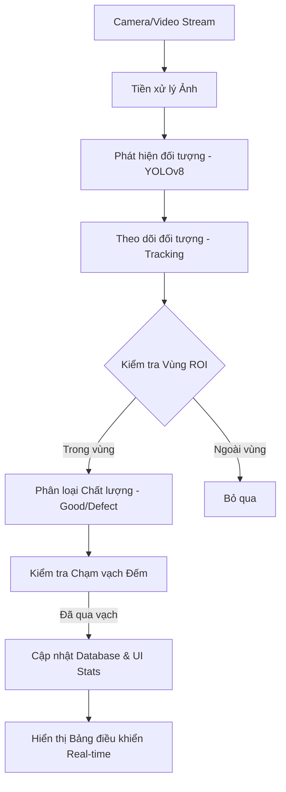

# Chi tiết Dự án: Hệ thống Kiểm soát Chất lượng và Đếm Khoai tây Công nghiệp

## 1. Giới thiệu Tổng quan
Dự án là một giải pháp thị giác máy tính (Computer Vision) toàn diện, được thiết kế để tự động hóa quy trình kiểm tra chất lượng và thống kê số lượng khoai tây trên băng chuyền công nghiệp. Hệ thống kết hợp sức mạnh của học sâu (Deep Learning) thông qua YOLOv8 và các kỹ thuật xử lý ảnh truyền thống để đạt được độ chính xác và tốc độ xử lý thời gian thực.

## 2. Công nghệ Sử dụng (Tech Stack)
- **Ngôn ngữ lập trình:** Python 3.x
- **Thư viện AI/CV:** 
    - **YOLOv8 (Ultralytics):** Phát hiện và phân loại đối tượng.
    - **OpenCV:** Tiền xử lý ảnh, vẽ giao diện overlay, và xử lý luồng video.
- **Giao diện người dùng (GUI):** PyQt5 (Cung cấp bảng điều khiển công nghiệp đa luồng).
- **Cơ sở dữ liệu:** SQLite (Lưu trữ lịch sử đếm và kết quả kiểm tra).
- **Theo dõi đối tượng (Tracking):** ByteTrack hoặc các thuật toán tương đương để duy trì ID đối tượng qua các khung hình.

## 3. Kiến trúc Hệ thống

### Luồng Hoạt động (Workflow)

## 4. Các Tính năng Chính

### A. Quản lý Vùng Kiểm tra (ROI - Region of Interest)
- Cho phép người dùng tùy chỉnh vùng quan tâm trên băng chuyền để tối ưu hóa hiệu suất xử lý.
- Có khả năng định nghĩa các "Define Zone" - nơi hệ thống sẽ tập trung phân tích đặc điểm chất lượng trước khi đưa ra kết luận cuối cùng.

### B. Phát hiện và Phân loại (Detection & Classification)
- Sử dụng mô hình YOLO đã được huấn luyện đặc thù cho khoai tây.
- Phân biệt khoai tây "Đạt chuẩn" (Good) và "Lỗi/Hỏng" (Defect).
- Hiển thị trạng thái "DEFINING" khi khoai tây đang nằm trong vùng phân tích.

### C. Cơ chế Đếm Thông minh (Counting Logic)
- Sử dụng ID duy nhất cho từng củ khoai để tránh đếm lặp.
- Đếm số lượng dựa trên việc đối tượng đi qua một "Vạch đếm" (Counting Line) được thiết lập sẵn.

### D. Bảng điều khiển Công nghiệp (Industrial Dashboard)
- Hiển thị thông số thời gian thực: Tổng số lượng, Số lượng đạt, Số lượng lỗi.
- Biểu đồ thống kê và nhật ký hoạt động (Operation Log).
- Tùy chỉnh tham số mô hình (Confidence, IOU) ngay trên giao diện.

## 5. Cấu trúc Thư mục & Vai trò File
- `main.py`: Khởi chạy ứng dụng và điều phối các luồng (Thread) xử lý.
- `ui.py`: Định nghĩa cấu trúc giao diện người dùng.
- `detector.py`: Logic tích hợp mô hình YOLOv8.
- `tracker.py`: Duy trì mã định danh (ID) cho từng đối tượng di chuyển.
- `counter.py`: Xử lý logic đếm khi đối tượng chạm/vượt qua vạch.
- `preprocessing.py`: Các thuật toán lọc nhiễu, tách nền và Convex Hull để làm rõ đặc điểm khoai tây.
- `database.py`: Quản lý các truy vấn và lưu trữ dữ liệu vào SQLite.
- `video_capture.py`: Quản lý kết nối camera và giải mã video.

## 6. Ưu điểm Nổi bật
1. **Xử lý Đa luồng (Multi-threading):** Đảm bảo giao diện không bị giật lag khi model AI đang xử lý nặng.
2. **Độ tin cậy cao:** Giảm thiểu sai sót do điều kiện ánh sáng thay đổi nhờ các bước tiền xử lý ảnh nâng cao.
3. **Tính tùy biến:** Dễ dàng thay đổi vạch đếm, vùng ROI và các ngưỡng tin cậy để phù hợp với từng loại băng chuyền khác nhau.
